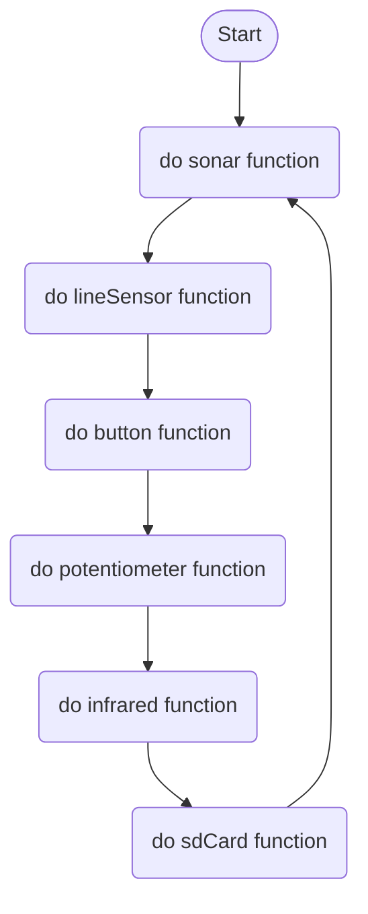
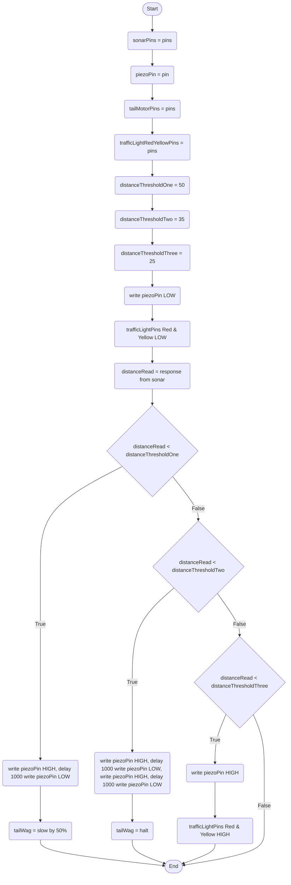
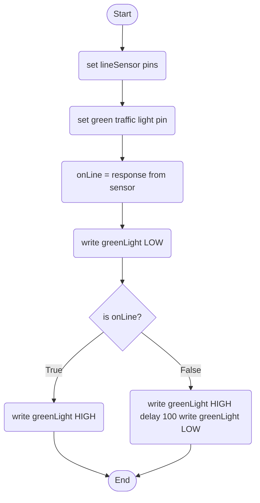
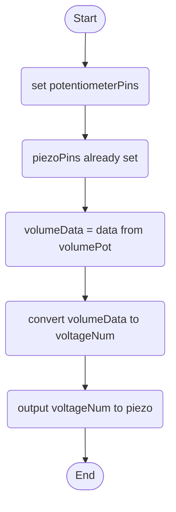
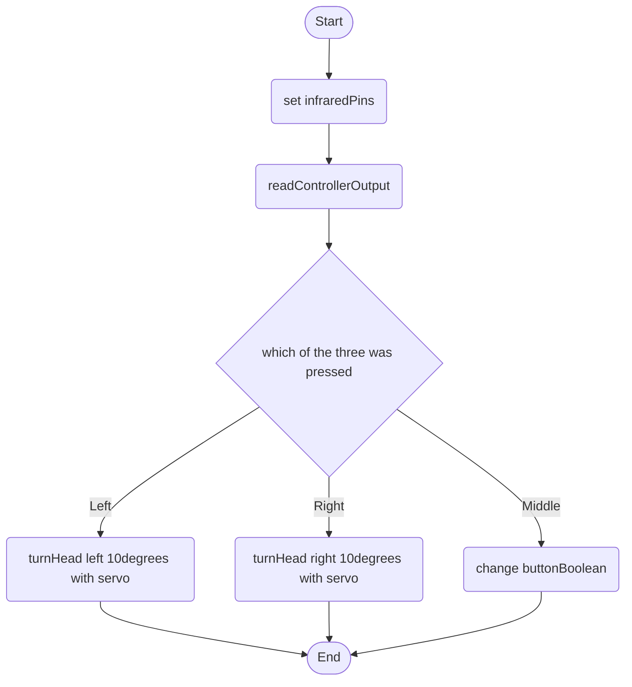
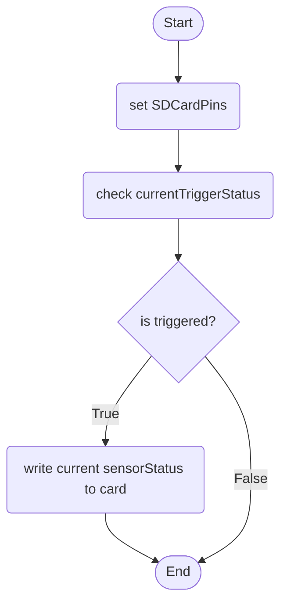

When someone has entered the first range (50 centimeters) it will sound 1 buzz from the piezo and slow its passive wag by half (DC Motor). When someone enters the second range (35 cm) it will buzz twice and stop tail wag (DC Motor). If someone enters trigger range (25 cm) it will begin a constant buzzing.

It will follow a line sensor path, if it is blocked it will turn on all lights and try the path again after a few seconds.

A button can be used to disable all functionality/turn off the dog, and can then turn it back on.

A potentiometer will be able to control the volume of its buzzer output.

An infrared remote can be used to override the security protocol and allow access to its area of guarding.
The infrared controller can also command the robot dog to rotate its head with a servo motor.

Whenever the dog has any triggers from sonar, line or infrared it will save its current data (sensor info) to an sd card log (what range target is at, if line is broken or if infrared has been activated). 
