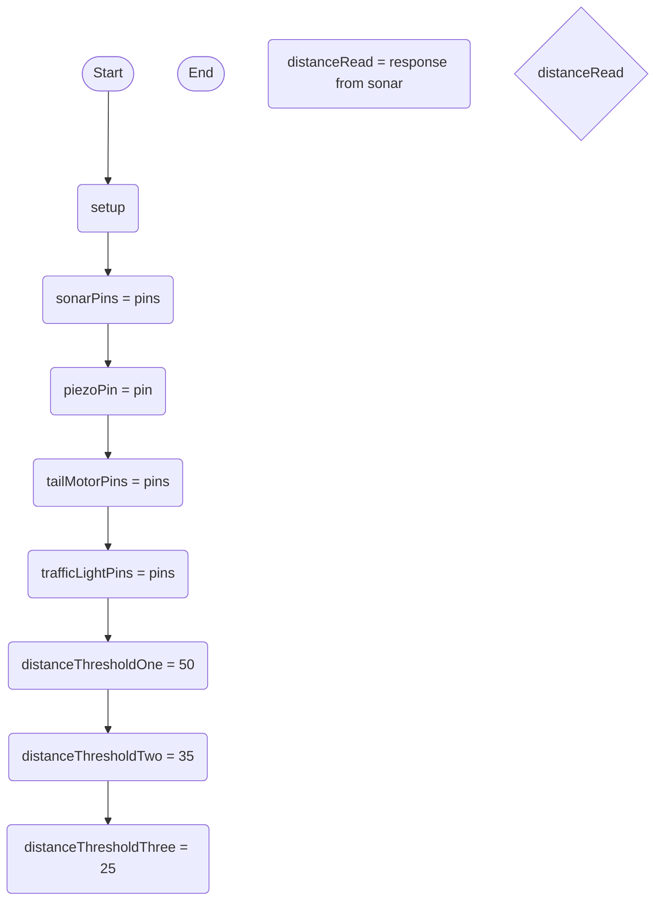

```mermaid
flowchart TD
terminalStart([Start])
terminalEnd([End])
setupStart(setup)
setSonarRead(sonarPins = pins)
setPiezoPin(piezoPin = pin)
setTail(tailMotorPins = pins)
setLight(trafficLightPins = pins)
thresholdSetOne(distanceThresholdOne = 50)
thresholdSetTwo(distanceThresholdTwo = 35)
thresholdSetThree(distanceThresholdThree = 25)
currentDistanceReading(distanceRead = response from sonar)
ifDistanceLessThanThresholdOne{distanceRead <distanceThresholdOne>}
terminalStart --> setupStart
setupStart --> setSonarRead
setSonarRead --> setPiezoPin
setPiezoPin --> setTail
setTail --> setLight
setLight --> thresholdSetOne
thresholdSetOne --> thresholdSetTwo
thresholdSetTwo --> thresholdSetThree
```