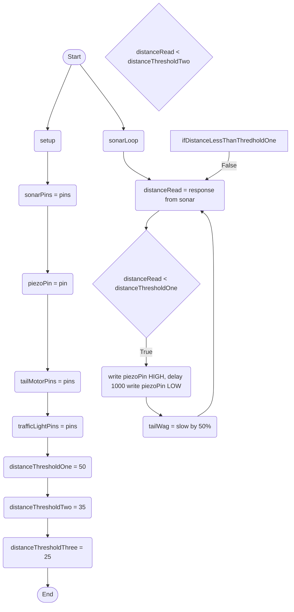

```mermaid
flowchart TD
terminalStart([Start])
terminalEnd([End])
setupStart(setup)
setSonarRead(sonarPins = pins)
setPiezoPin(piezoPin = pin)
setTail(tailMotorPins = pins)
setLight(trafficLightPins = pins)
thresholdSetOne(distanceThresholdOne = 50)
thresholdSetTwo(distanceThresholdTwo = 35)
thresholdSetThree(distanceThresholdThree = 25)
currentDistanceReading(distanceRead = response from sonar)
ifDistanceLessThanThresholdOne{distanceRead < distanceThresholdOne}
ifDistanceLessThanThresholdTwo{distanceRead < distanceThresholdTwo}
piezoOneBuzz(write piezoPin HIGH, delay 1000 write piezoPin LOW)
tailSlow(tailWag = slow by 50%)
sonarStart(sonarLoop)

terminalStart --> setupStart
setupStart --> setSonarRead
setSonarRead --> setPiezoPin
setPiezoPin --> setTail
setTail --> setLight
setLight --> thresholdSetOne
thresholdSetOne --> thresholdSetTwo
thresholdSetTwo --> thresholdSetThree
thresholdSetThree --> terminalEnd

terminalStart --> sonarStart
sonarStart --> currentDistanceReading
currentDistanceReading --> ifDistanceLessThanThresholdOne
ifDistanceLessThanThresholdOne --> |True| piezoOneBuzz
piezoOneBuzz --> tailSlow
tailSlow --> currentDistanceReading
ifDistanceLessThanThredholdOne --> |False| currentDistanceReading
```