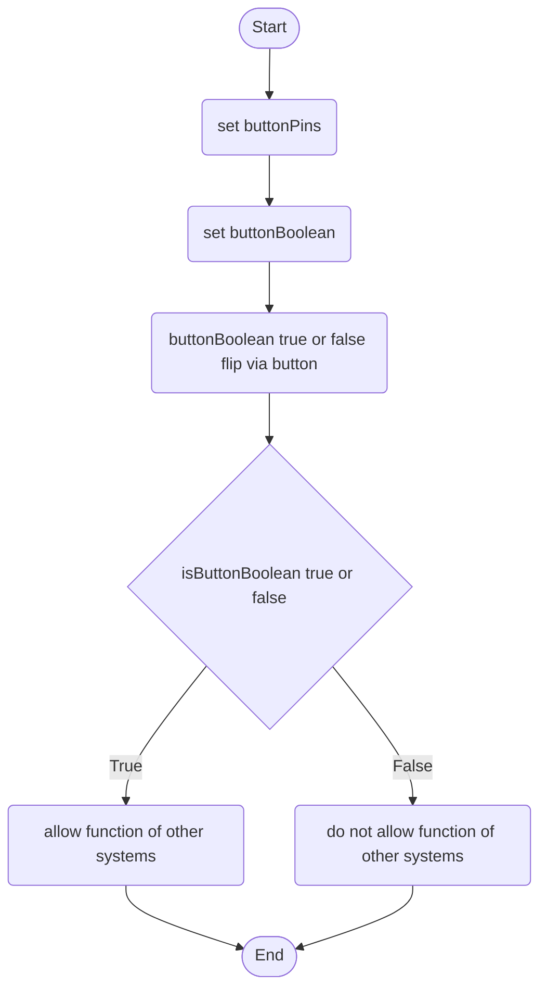
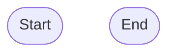

```mermaid
flowchart TD
terminalStart([Start])
terminalEnd([End])
setSonarRead(sonarPins = pins)
setPiezoPin(piezoPin = pin)
setTail(tailMotorPins = pins)
setRedYellowLight(trafficLightRedYellowPins = pins)
thresholdSetOne(distanceThresholdOne = 50)
thresholdSetTwo(distanceThresholdTwo = 35)
thresholdSetThree(distanceThresholdThree = 25)
currentDistanceReading(distanceRead = response from sonar)
ifDistanceLessThanThresholdOne{distanceRead < distanceThresholdOne}
ifDistanceLessThanThresholdTwo{distanceRead < distanceThresholdTwo}
ifDistanceLessThanThresholdThree{distanceRead < distanceThresholdThree}
piezoOneBuzz(write piezoPin HIGH, delay 1000 write piezoPin LOW)
piezoTwoBuzz(write piezoPin HIGH, delay 1000 write piezoPin LOW, write piezoPin HIGH, delay 1000 write piezoPin LOW)
piezoConstant(write piezoPin HIGH)
sonarLightAlarm(trafficLightPins Red & Yellow HIGH)
sonarLightAlarmReset(trafficLightPins Red & Yellow LOW)
piezoReset(write piezoPin LOW)
tailSlow(tailWag = slow by 50%)
tailStop(tailWag = halt)


terminalStart --> setSonarRead
setSonarRead --> setPiezoPin
setPiezoPin --> setTail
setTail --> setRedYellowLight
setRedYellowLight --> thresholdSetOne
thresholdSetOne --> thresholdSetTwo
thresholdSetTwo --> thresholdSetThree
thresholdSetThree --> piezoReset
piezoReset --> sonarLightAlarmReset
sonarLightAlarmReset --> currentDistanceReading
currentDistanceReading --> ifDistanceLessThanThresholdOne
ifDistanceLessThanThresholdOne --> |True| piezoOneBuzz
piezoOneBuzz --> tailSlow
tailSlow --> terminalEnd
ifDistanceLessThanThresholdOne --> |False| ifDistanceLessThanThresholdTwo
ifDistanceLessThanThresholdTwo --> |True| piezoTwoBuzz
piezoTwoBuzz --> tailStop
tailStop --> terminalEnd
ifDistanceLessThanThresholdTwo --> |False| ifDistanceLessThanThresholdThree
ifDistanceLessThanThresholdThree --> |True| piezoConstant
piezoConstant --> sonarLightAlarm
sonarLightAlarm --> terminalEnd
ifDistanceLessThanThresholdThree --> |False| terminalEnd
```

```mermaid
flowchart TD
terminalStart([Start])
terminalEnd([End])
declareLineSensor(set lineSensor pins)
setGreenLight(set green traffic light pin)
lineSensorData(onLine = response from sensor)
resetLight(write greenLight LOW)
ifOnLine{is onLine?}
isOnLine(write greenLight HIGH)
isNotOnLine(write greenLight HIGH delay 100 write greenLight LOW)

terminalStart --> declareLineSensor
declareLineSensor --> setGreenLight
setGreenLight --> lineSensorData
lineSensorData --> resetLight
resetLight --> ifOnLine
ifOnLine --> |True| isOnLine
isOnLine --> terminalEnd
ifOnLine --> |False| isNotOnLine
isNotOnLine --> terminalEnd
```

```mermaid
flowchart TD
terminalStart([Start])
terminalEnd([End])
setButton(set buttonPins)
setBoolean(set buttonBoolean)
buttonData(buttonBoolean true or false flip via button)
ifBooleanTrueFalse{isButtonBoolean true or false}
ifBooleanTrue(allow function of other systems)
ifBooleanFalse(do not allow function of other systems)

terminalStart --> setButton
setButton --> setBoolean
setBoolean --> buttonData
buttonData --> ifBooleanTrueFalse
ifBooleanTrueFalse --> |True| ifBooleanTrue
ifBooleanTrue --> terminalEnd
ifBooleanTrueFalse --> |False| ifBooleanFalse
ifBooleanFalse --> terminalEnd
```

```mermaid
flowchart TD
terminalStart([Start])
terminalEnd([End])


```