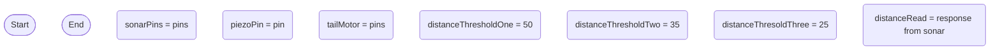

```mermaid
flowchart TD
terminalStart([Start])
terminalEnd([End])
setSonarRead(sonarPins = pins)
setPiezoPin(piezoPin = pin)
setTail(tailMotor = pins)
thresholdSetOne(distanceThresholdOne = 50)
thresholdSetTwo(distanceThresholdTwo = 35)
thresholdSetThree(distanceThresoldThree = 25)
currentDistanceReading(distanceRead = response from sonar)
```