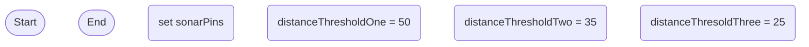

```mermaid
flowchart TD
terminalStart([Start])
terminalEnd([End])
declareSonarRead(set sonarPins)
thresholdSetOne(distanceThresholdOne = 50)
thresholdSetTwo(distanceThresholdTwo = 35)
thresholdSetThree(distanceThresoldThree = 25)

```